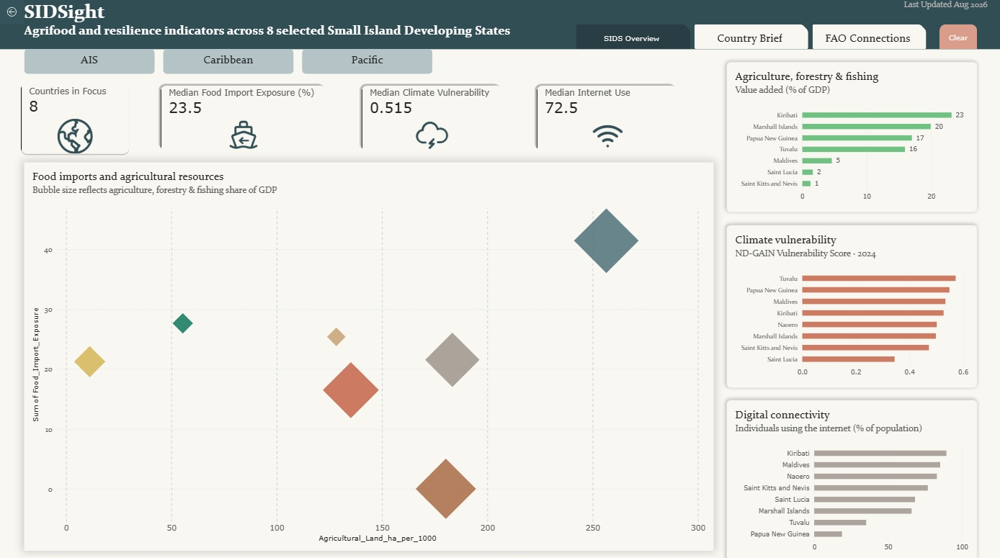

# SIDSight
**Agrifood Policy Explorer for Small Island Developing States**

SIDSight is a small exploratory project looking at **how public data and policy information can support preparation for SIDS-focused discussions**.


## Explore the project

- **SIDS Overview** — cross-country comparison of selected agrifood, resource, digital and climate indicators
- **Country Brief** — country-level context for policy discussions
- **FAO Connections** — links between selected country issues and FAO's SIDS-related work

The first version covers 8 Small Island Developing States across the Pacific, Caribbean, and Atlantic, Indian Ocean and South China Sea (AIS) regions.


## Why I built this

At UNESCO, most of my job is the monitoring side of an international convention — reviewing country reports, identifying gaps, preparing for bilateral and regional discussions, and following up with governments, particularly where implementation support is needed. A large number of those countries are SIDS. 

This experience made me interested in how a similar country-focused workflow could be applied in a different policy area. SIDSight is my attempt to take **a small set of public agrifood and development data**, turn it into a **concise country picture**, and then **connect what the data show with issues and programmes FAO is already working on**.

## The 3 questions it tries to answer

1. **Cross-country view** — What do selected indicators tell us about **different SIDS agrifood contexts**?
2. **Country brief** — What information would be useful when preparing for **a country-level policy discussion**?
3. **FAO link** — How do these issues connect with **FAO's existing SIDS dialogues, programmes and areas of work**? 

## The 8 countries

| Region | Countries |
|---|---|
| Pacific | Kiribati · Marshall Islands · Nauru · Papua New Guinea · Tuvalu |
| Caribbean | Saint Kitts and Nevis · Saint Lucia |
| AIS | Maldives |

I chose these countries because they span the three main SIDS regions and are countries that I frequently work with through my work on convention monitoring and capacity-building.

## How it's built

| Tool | What it's doing here |
|---|---|
| Python / pandas | Filtering World Bank and FAO data down to these 8 countries, pulling the latest observation for each indicator, computing per-capita figures, and auditing how current each data point actually is |
| Power BI | Three linked pages — SIDS Overview, Country Brief, FAO Connections |
| ArcGIS | Adds a simple geographic view of the countries and selected indicators |
| GitHub | Documents the data, methodology and project development in one place |

## What's inside

```
SIDSight/
├── data/            raw and processed indicator data
├── notebooks/        the pandas workflow: filter → latest observation → derived indicators → audit → merge
├── dashboard/         Power BI page screenshots
├── gis/                the country map
├── digest/            a one-page AI-assisted SIDS Digest prototype
└── methodology/      indicator definitions, sources, and the reasoning behind every design choice
```

## Methodology, in short

The project deliberately uses a small number of indicators rather than trying to build a comprehensive SIDS index or country ranking. The whole methodology can be found in [`methodology/methodology.md`](methodology/methodology.md).


> **Disclaimer:** SIDSight is an independent portfolio project and is not an official FAO or UNESCO product.
