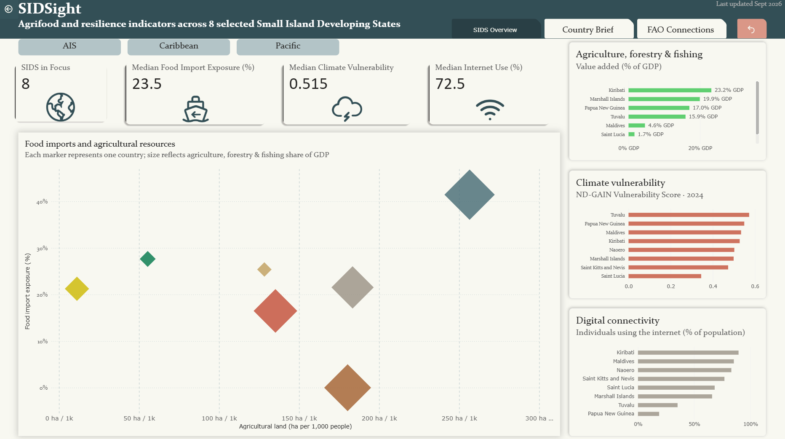

# SIDSight
**Agrifood Evidence & Communication Explorer for SIDS**

SIDSight is an independent exploratory project looking at **how data and clear communication can support preparation for SIDS-focused discussions**. It brings together selected agrifood, climate, resource and connectivity indicators and translates them into concise visual and country-level views designed for **briefing, communication and policy dialogue**.


## Explore the project

- **SIDS Overview** — cross-country comparison of selected agrifood, resource, digital and climate indicators
- **Country Brief** — country-level context for policy discussions
- **FAO Connections** — links between selected country issues and FAO's SIDS-related work

The first version covers 8 Small Island Developing States (SIDS) across the Pacific, Caribbean, and Atlantic, Indian Ocean and South China Sea (AIS) regions.


## Why I built this

In my current work at UNESCO, I support the monitoring of an international convention, including reviewing country reports, preparing briefing and communication materials, and following up with governments and Permanent Missions. A number of the countries I work with are SIDS.

That experience made me interested in a broader question: **how can country-level evidence be turned into information that is clear and quick to navigate before a meeting?**

SIDSight is my attempt to explore that question in an agrifood context. I brought together a small set of public indicators, organized them into concise views, and experimented with different ways of communicating the evidence through dashboards, maps and short contextual explanations.

The project is therefore as much about **communication and information design** as it is about data: deciding what to show, what context is needed, how much detail an audience can absorb, and how technical evidence can be made more useful for non-specialist discussion.

## The 3 questions it tries to answer

1. **What should an audience notice first?**  
2. **What context does a country brief need?**  
3. **How can evidence connect to FAO's existing initiatives and further action?**  

## The 8 countries

| Region | Countries |
|---|---|
| Pacific | Kiribati · Marshall Islands · Nauru · Papua New Guinea · Tuvalu |
| Caribbean | Saint Kitts and Nevis · Saint Lucia |
| AIS | Maldives |

I chose these countries because they span the three main SIDS regions and are countries that I frequently work with through my work on convention monitoring and capacity-building.

## How it's built

| Tool | What it's doing here |
|---|---|
| Python / pandas | Pulling the latest observation for each indicator, computing per-capita figures, and auditing how current each data point actually is |
| Power BI | Three linked pages — SIDS Overview, Country Brief, FAO Connections |
| ArcGIS | Adds a simple geographic view of the countries and selected indicators |
| GitHub | Documents the data, methodology and project development in one place |

## What's inside

```
SIDSight/
├── data/            raw and processed indicator data
├── dashboard/         Power BI page screenshots
├── gis/                the country map
└── methodology/      indicator definitions, sources, and the reasoning behind every design choice
```

## Methodology

The whole methodology can be found in [`methodology/methodology.md`](methodology/methodology.md).


> **Disclaimer:** SIDSight is an independent portfolio project and is not an official FAO or UNESCO product.
